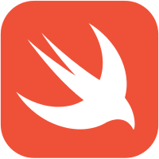

# Supported tags and respective `Dockerfile` links

[](https://travis-ci.org/bartoszj/docker-swift-dev)
[](https://imagelayers.io/?images=bartoszj/swift-dev:latest 'Get your own badge on imagelayers.io')
<!-- [](https://hub.docker.com/r/bartoszj/swift-dev)
[](https://hub.docker.com/r/bartoszj/swift-dev) -->

https://hub.docker.com/r/bartoszj/swift-dev/

- [`jessie`, `latest` (*jessie/Dockerfile*)](https://github.com/bartoszj/docker-swift-dev/blob/master/jessie/Dockerfile)
- [`stretch` (*stretch/Dockerfile*)](https://github.com/bartoszj/docker-swift-dev/blob/master/stretch/Dockerfile)
- [`sid` (*sid/Dockerfile*)](https://github.com/bartoszj/docker-swift-dev/blob/master/sid/Dockerfile)
- [`trusty` (*trusty/Dockerfile*)](https://github.com/bartoszj/docker-swift-dev/blob/master/trusty/Dockerfile)
- [`wily` (*wily/Dockerfile*)](https://github.com/bartoszj/docker-swift-dev/blob/master/wily/Dockerfile)
- [`xenial` (*xenial/Dockerfile*)](https://github.com/bartoszj/docker-swift-dev/blob/master/xenial/Dockerfile)

# What is Swift?



Swift is a general-purpose programming language built using a modern approach to safety, performance, and software design patterns.

The goal of the Swift project is to create the best available language for uses ranging from systems programming, to mobile and desktop apps, scaling up to cloud services. Most importantly, Swift is designed to make writing and maintaining correct programs easier for the developer.

> https://swift.org/

## Build image

```
docker build -t swift-dev .
```

## Build Swift

- Clone Swift repository:
```
git clone https://github.com/apple/swift.git
./swift/utils/update-checkout --clone
```
- Build Swift:
```
docker run --rm -v ${PWD}:/swift --privileged bartoszj/swift-dev
```

## Install
Compilation build will be placed in the `install_jessie` folder and in the `swift_jessie.tar.gz` archive. If you want to build Swift using other version of Debian or Ubuntu use eg.: `bartoszj/swift-dev:wily`.

### Build tips
- If you want to save build products you can use:
```
docker run --rm -v ${PWD}:/swift -v swift_build:/swift_build --privileged bartoszj/swift-dev
```

# License

The MIT License (MIT)

Copyright (c) 2016 Bartosz Janda

Permission is hereby granted, free of charge, to any person obtaining a copy
of this software and associated documentation files (the "Software"), to deal
in the Software without restriction, including without limitation the rights
to use, copy, modify, merge, publish, distribute, sublicense, and/or sell
copies of the Software, and to permit persons to whom the Software is
furnished to do so, subject to the following conditions:

The above copyright notice and this permission notice shall be included in all
copies or substantial portions of the Software.

THE SOFTWARE IS PROVIDED "AS IS", WITHOUT WARRANTY OF ANY KIND, EXPRESS OR
IMPLIED, INCLUDING BUT NOT LIMITED TO THE WARRANTIES OF MERCHANTABILITY,
FITNESS FOR A PARTICULAR PURPOSE AND NONINFRINGEMENT. IN NO EVENT SHALL THE
AUTHORS OR COPYRIGHT HOLDERS BE LIABLE FOR ANY CLAIM, DAMAGES OR OTHER
LIABILITY, WHETHER IN AN ACTION OF CONTRACT, TORT OR OTHERWISE, ARISING FROM,
OUT OF OR IN CONNECTION WITH THE SOFTWARE OR THE USE OR OTHER DEALINGS IN THE
SOFTWARE.
